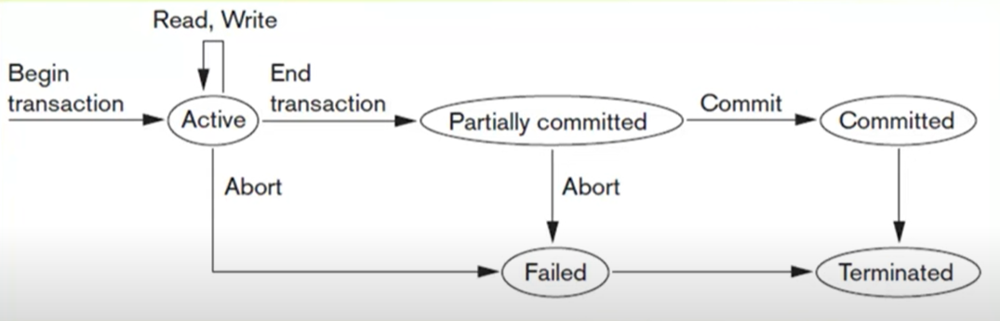
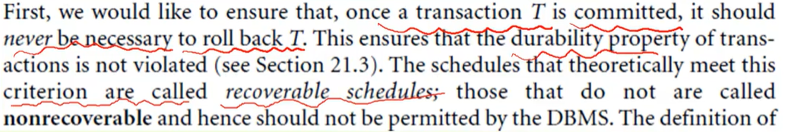

## intro to transaction processing concepts & theory :
### transaction : 

- set of steps (mutable operations) that had to run all together or not at all .
### DBMS :

1. single user system : only one user can access DB at a time .
2. multiple user system : multiple users can access DB concurrently (multi programming) .

---
## transaction read-write operations :
### transaction :

- an execution program that forms a single logical unit of database processing, that includes set of data access operations (insert - read - update - delete) .
#### how transaction looks like ?

```
begin transaction
	select
	update 
	....
	....
end transaction
```
#### types of transaction ?

1. read-only transaction .
2. read-write transaction .
#### database : 

- represented as collection of named data items --> attribute, record .. .
#### operations :

1. read_item(x) : read data item x from db and must be assigned to application variable .
2. write_item(y) : read variable y to db item called y .

---
## steps of read-write operations :

- data stored in blocks .
- block may contain multiple records .
### read :

- load block to memory buffer .
- copy data item into application variable .
### write :

if we are going to change value of existing variable:
- find variable in disk and load it into memory buffer if not loaded .
- copy value from program variable into variable in buffer .
- store updated block from buffer .
- update it into db immediately or at some point .

---
## why concurrency control is needed ?

### what is concurrency control ? 

- it is the way to make sure that if we had multiple transactions running at same time they are running in a correct way .
#### note :

- transactions submitted by different users at same time may provide different data access operations at the same time to the same data, if these transactions are not controlled they may lead to inconsistency of data .
### list problems if there is no concurrency control ?

- lost update problem .
- temporary update, dirty read .
- incorrect summary .
- unrepeated read .

---
## why recovery is needed ?

- it is all about how to restore database to how it looks before any problem occurs .
- if a transaction is submitted to DBMS and all data access operations inside the transaction executed successfully so we had to commit the changes .
- if there any problems occurs, we had to undone the transaction and return database to how it looks before beginning the transaction .
### types of failure which may lead to recovery operation :

1. computer failure (system crash) : hardware, software, network .
2. a transaction of system error : divide by zero, integer overflow.
3. local error, exception condition : insufficient balance when transferring .
4. concurrency problem .
5. disk failure .
6. physical problems : storm .

---
## transaction states 




---
## system logs 
### what is it ?

- a file stored in hard disk, used to store any changes happens to database and used for recovery .
- logs is sequentially added .
- it is append only .
- logs can't be stored in main memory -> volatile .
### log file records :

1. start transaction .
2. write, t, x, old value, new value .
3. read, t, x .
4. commit, t -> can be committed .
5. abort, t .

---
## transaction properties 

- each transaction must have the following properties which called ACID .
### ACID :
#### A : Atomicity :

- each transaction is an atomic unit of processing, which means all operations execute entirety or not at all .
#### C : Consistency :

- data must match database constrains, and transaction leaves database state consistence as it was . 
- Example :
  Ahmed has 400 EGP : Mohamed has 500 EGP . so total is 900 
  if Ahmed sent 100 to Mohamed the total must also remain 900 .
#### I : Isolation :

- each transaction must be isolated from other transactions .
#### D : Durability :

- if transaction executed successfully, the changes must be applied to database no matter what happens .

| property | responsibility of             |
| :------: | ----------------------------- |
|    A     | recovery subsystem            |
|    C     | programmer                    |
|    I     | concurrency control subsystem |
|    D     | recovery subsystem            |

---
## characterizing schedules based on recoverability :
### schedule :

- when two transactions are in interleaved fashion, the order of execution of operations from different transactions, called schedule (history of transaction) .
	- الترتيب الزمني لتنفيذ الخطوات اللي جايه من transactions مختلفه .

- why to use schedule ?
	- to decide which transaction should be executed before the other one .
### conflict :

- to say that there is a conflict the following 3 rules must exist :
	1. operations from different transactions .
	2. the operation on the same data item .
	3. at least one write operation .
### schedule types :
#### recoverable & non recoverable :



#### cascading rollback & cascade less :

1. cascading rollback : means that if T1 writes on item x and T2 reads it. if T1 aborted, T2 will also be aborted .
2. cascade less : if T1 writes on an data item no other transaction can read this item until T1 commits .
#### strict schedule :

- if T1 writes on an data item no other transaction can read or write on this data item until T1 commits .
## Concurrency control :
### Purpose of concurrency control :

1. each transaction had to be isolated .
2. solve conflict problems by deciding which transaction to get the desired data item .
### Two-Phase Locking :
#### Locking :

- it is an operation which ensures permission of 
	1. reading an item .
	2. writing on an item .
- Lock (X) -> data item x is locked for a transaction .
#### Unlocking :

- an operation which removes permissions from data item .
- unlock (x) -> data item x is available .
#### Lock modes :

1. shared lock (read) : all transactions can apply read lock on same data item but no write lock .
2. exclusive lock (write) : only one transaction can apply write lock and no other transaction can apply another lock .
#### Lock manager :

- it is a component which responsible for managing lock requests and check if a lock can be applied on a data item.
#### Lock table :

- used to identify transaction locking data item, data item, lock type, next data item .
#### Lock Conversion :

- when you want to change type of locking on specific data item .
1. upgrade from read to write :
  - we check if there any other read lock on the data item, and if there any other lock the transaction had to wait for them, if  not the lock will e changed .
1. downgrade from write to read :
   - only one transaction can have write lock on the data item, so convert directly from write to read .
#### Two-Phase Locking :

1. Locking (growing) : apply lock (read - write) on desired data item one at a time .
2. unlocking (shrinking) : transaction unlocks it is locked data .
- Requirements :
  - in locking phase unlocking can't start, in unlocking phase lock can't start anymore.

---
# Dealing with deadlocks & starvation 
## Deadlocks 
### A. what is dead lock ?

- it is when two different transactions waiting for data items that are holds by each other .

### B. How to solve deadlocks ?

#### 1. conservative two phase locking :
-  each transaction will lock all desired data items before beginning so no more waiting .
#### 2. Strict two phase locking :
- transaction won't unlock data items till it terminate .
### C. dealing with starvation
#### dead lock prevention :
- t locks all desired data items before beginning execution .
- prevent deadlocks since no waiting for data items .
- conservative two phase locking is used .
### D. deadlock detection & resolution 

- in this approach deadlocks are allowed, maintaining transactions in a waiting graph for detecting cycle. if a cycle found, one transaction is selected & rolled back.
#### starvation :
- means that a transaction is always stuck in a deadlock and be the one chosen to terminate. 
## timestamp :

- another concurrency control technique like 'two phase locking' .
### time stamp based algorithm 
#### what is time stamp ?
- the time of an transaction when entering system .
- integer number increasing with each new transaction .
- used to serialize execution of concurrent transactions .
### time stamp ordering protocol 

- الأولويه لل transaction الاقدم .
- القديمه تتنفذ الاول بس لو إتأخرت وبعدين جت لفت transaction احدث منها يبقى خلاص القديمه هيحصل لها rollback.
#### note :
- any data item has two properties .
	1. read time stamp RTS .
	2. Write time stamp WTS .
	- updated to last transaction time stamp .
### 1. Basic time stamp ordering :
#### 1. T wants to write data_item(x) :
- if read_TS(X) > TS(T) or write_TS(X) > TS(T) :
  yes ? abort and rollback T,
  no ? continue and set write_ts(X) = TS(T).
#### 2. T wants to read data_item(X) :
- if write_TS(X) > TS(T) then abort T and roll back,
  Else if write_TS(X) <= TS(T) read and make read_TS(X) = bigger of current read or old read .
### 2. Strict time stamp ordering :

- T wants to read : if TS(T) > write_TS(X) wait till t' terminate .
- T wants to write : TS(T) > read_TS(X) wait till T' terminate .
## Concurrency Control Schema 
### validation 'Optimistic' Concurrency control 
#### تعريفه ؟
- هيا طريقه بنكون متفائلين فيها انه مش هيحصل اي تعارض بين ال transactions .
- هقرأ البيانات من الداتا بيز عادي وهشتغل على نسخه منها locally والتعديل هيسمع في الداتا بيز في مرحلة ال commit فقط .
- عشان اعمل كده عندي 3 مراحل :
##### 1. القراءة (reading) :
- هقرأ البيانات من قاعدة البيانات عادي وهخزنها عندي على الهارد بتاعي او في الميموري مثلا و اعدل عليها براحتي بعيداَ عن قاعدة البيانات .
##### 2. التحقق (validation) : 
- بعد ما اخلص تعديل هشوف في اي تعارض بين التعديلات بتاعتي و البيانات اللي في قاعدة البيانات ولا لا قبل ما اعمل commit . "هشوف حد عدل في البيانات اللي قرأتها ولا لا مثلاً" .
##### 3. الكتابة (write) :
- لو التحقق تم بشكل صحيح خلاص هنفذ التعديل بتاعي على قاعدة البيانات .
- لو في مشكله هنعمل rollback لل transaction وهنعيد من الاول .
#### ايه فايدته ؟
- ال locks بتاخد وقت كبير وبتجهد ال CPU ف انا اتخلصت من موضوع ال locks ده خالص .
#### إمتى نستخدمه ؟
- القراءة عندي كتير والتعديل قليل .
- مثال : تطبيق ويب فيه مستخدمين كتير بيقرأوا في نفس الوقت والتعديل قليل او نادر .
## Granularity of data items 

### what is granularity ?

- the size of the data item it self it could be :
  - field.
  - tuple, record,
  - block, page.
  - file.
  - DB.

- the more we get bigger size the less of concurrent transactions and less locks .
- unit of granularity :
  - fine -> field, record .
  - coarse -> DB .
#### more locks types based on granularity :
- intention shared IS.
- intention exclusive IX.
- shared-intention-exclusive SIX .
---
